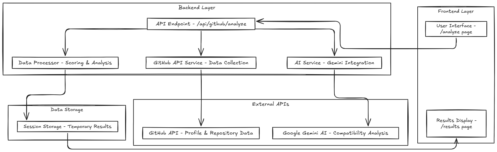

# GitCompat Architecture Documentation


## System Architecture & Workflow




### Workflow

1. **Input Phase**: User enters two GitHub usernames via the analysis form
2. **Data Collection**: 
   - Parallel GitHub API calls fetch comprehensive profile data
   - Collects repos, commits, languages, activity patterns, collaboration metrics
3. **Data Processing**: 
   - `GitHubDataProcessor` transforms raw data into structured analysis
   - Calculates activity, collaboration, and code quality scores
4. **AI Analysis**: 
   - Processed data sent to Gemini AI with structured prompts
   - AI provides compatibility insights, recommendations, and predictions
5. **Response Generation**: Combined algorithmic + AI results returned to frontend
6. **Visualization**: Results displayed with scores, charts, and actionable insights

## API Routes & Endpoints

### Frontend Routes
- `/` - Landing page with features and CTA
- `/analyze` - Analysis form and input interface  
- `/results` - Compatibility analysis results display
- `/contribute` - Contribution guidelines (WIP)

### Backend API Routes
- `POST /api/github/analyze` - Main analysis endpoint
  - **Input**: `{ userA: string, userB: string, customPrompt?: string }`
  - **Output**: `{ success: boolean, data: CompatibilityAnalysis, error?: ApiError }`
  - **Process**: GitHub data collection → Processing → AI analysis → Response

### External API Integrations
- **GitHub API**: Profile, repository, commit, and language data collection
- **Google Gemini API**: AI-powered compatibility analysis and insights

## Rate Limiting & API Management

### GitHub API Rate Limits
- **Without Personal Access Token**: 60 requests per hour
- **With Personal Access Token**: 5000 requests per hour

### Implementation (`@/lib/githubApi.ts`)

**Rate Limit Detection:**
- Monitors `x-ratelimit-remaining` and `x-ratelimit-reset` headers
- Calculates wait time and displays user-friendly error messages
- Adds 10-minute buffer to reset time estimates

**Request Optimization:**
- Parallel API calls for both users (`Promise.all`)
- Limits to 10 most recent repositories per user
- Fetches last 50 commits per repository only
- 100ms delay between repository processing requests

**Token Management:**
- Optional GitHub Personal Access Token from environment
- Automatic token detection and header inclusion
- 83x rate limit increase with token (60 → 5000 requests/hour)

## Project Structure

```
gitcompat/
├── app/                          # Next.js App Router
│   ├── analyze/                  # Analysis form page
│   ├── api/github/analyze/       # Main API endpoint
│   ├── results/                  # Results display page
│   └── contribute/               # Contribution page
├── components/                   # React components
│   ├── analyze/                  # Analysis form components
│   ├── home/                     # Landing page components
│   ├── results/                  # Results display components
│   └── ui/                       # Reusable UI components
├── lib/                          # Core business logic
│   ├── githubApi.ts              # GitHub API integration
│   ├── geminiApi.ts              # AI analysis integration
│   ├── githubDataProcessor.ts    # Data processing algorithms
│   ├── prompts.ts                # AI prompt engineering
│   ├── types.ts                  # TypeScript definitions
│   └── utils.ts                  # Utility functions
├── docs/                         # Documentation
└── public/                       # Static assets
```


